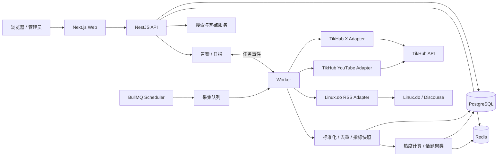
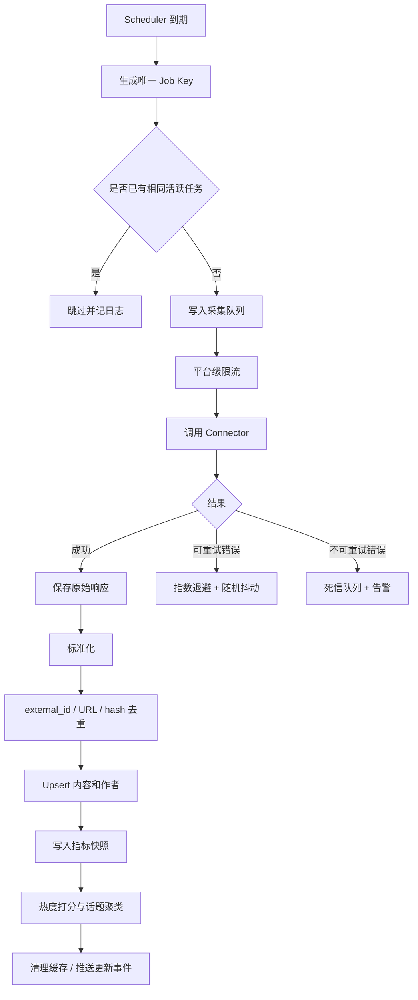

# X / YouTube / Linux.do 热点聚合平台架构提案

> 状态：本地 MVP 开发与验证中  
> 日期：2026-07-26  
> 暂定项目名：TrendHub  
> 文中的 `Linux.do` 指用户所写的 `linxudo`

## 0. 已确认的实施决策

- 使用场景：团队内部系统；
- 不提供应用内登录；
- 重点主题：大模型、Codex、AI Agent、VPS、U 币/USDT、开卡及相关最新资讯；
- 目标部署区域：美国洛杉矶；
- AI 摘要首期加入；
- TikHub 采用 BYOK：每位使用者可在自己的浏览器中配置个人 API Key；
- 个人 Key 经 AES-GCM 加密后保存在 HttpOnly Cookie，不写入数据库；
- 无浏览器上下文的定时采集使用管理员通过环境变量配置的服务端 Token；
- 当前阶段只做本地开发、调试和稳定性验证，不进行公网部署；
- 上线时即使不做应用登录，也必须通过 VPN、IP 白名单或访问网关限制团队访问。

## 1. 项目目标

构建一个只读的信息聚合与热点发现平台，自动、定时地获取：

- X（Twitter）的地区趋势、关键词搜索结果、指定账号最新推文；
- YouTube 的地区趋势、关键词搜索结果、指定频道最新视频或 Shorts；
- Linux.do 的最新话题、每日热门话题和指定分类内容；
- 对不同平台的数据进行统一清洗、去重、打分、聚类、搜索与展示；
- 支持定时采集、失败重试、采集状态、API 成本统计和异常告警；
- 后续可以扩展 AI 摘要、跨平台话题聚类、日报和消息通知。

首期不做自动发帖、评论、点赞、关注、私信，不采集私密或权限受限内容，也不默认下载或重新托管视频文件。

## 2. 已确认的数据源能力

### 2.1 X

TikHub 原生提供 X 的只读接口，可用于推文详情、用户资料、用户时间线、搜索、评论和趋势：

- 趋势：`GET /api/v1/twitter/web/fetch_trending`
- 用户推文：`GET /api/v1/twitter/web/fetch_user_post_tweet`
- 搜索：`GET /api/v1/twitter/web/fetch_search_timeline`
- 推文详情：`GET /api/v1/twitter/web/fetch_tweet_detail`
- 评论：`GET /api/v1/twitter/web/fetch_post_comments`

参考：

- [TikHub X API](https://tikhub.io/twitter-api)
- [X 趋势接口](https://docs.tikhub.io/219522633e0)
- [X 用户推文接口](https://docs.tikhub.io/191321711e0)

### 2.2 YouTube

TikHub 原生提供 YouTube 视频、频道、搜索、Shorts、字幕、评论和趋势接口。首期使用结构化程度较高的新版本接口：

- 趋势：`GET /api/v1/youtube/web/get_trending_videos`
- 综合搜索：`GET /api/v1/youtube/web_v2/get_general_search_v2`
- 频道视频：`GET /api/v1/youtube/web_v2/get_channel_videos`
- 视频详情：`GET /api/v1/youtube/web_v2/get_video_info_v2`
- 字幕：`GET /api/v1/youtube/web_v2/get_video_captions_v2`
- 评论：`GET /api/v1/youtube/web_v2/get_video_comments`

参考：

- [TikHub YouTube API](https://tikhub.io/youtube-api)
- [YouTube 综合搜索 V2](https://docs.tikhub.io/431829299e0)
- [YouTube 趋势视频](https://docs.tikhub.io/413417989e0)

### 2.3 Linux.do

TikHub 当前没有 Linux.do 专用接口。Linux.do 基于 Discourse，可优先使用公开 RSS：

- 最新话题：`https://linux.do/latest.rss`
- 每日热门：`https://linux.do/top.rss?period=daily`
- 分类：`https://linux.do/c/{category-slug}/{category-id}.rss`
- 单个公开话题：`https://linux.do/t/topic/{topic-id}.rss`

如果公开 JSON 可稳定访问，可以按需补充帖子统计；否则首期只依赖 RSS。Linux.do 的 RSS 曾出现 Cloudflare 403，因此连接器必须低频访问、使用条件请求、遵守 `Retry-After`，被阻断时暂停并告警，不做绕过。

参考：

- [Discourse API 文档](https://docs.discourse.org/)
- [Linux.do 每日热门 RSS 用法](https://linux.do/t/topic/566534)
- [Linux.do RSS 403 讨论](https://linux.do/t/topic/2510728)

### 2.4 TikHub 调用约束

- 所有 Token 都只由后端通过 `Authorization: Bearer ...` 调用 TikHub；
- 手动同步优先使用当前浏览器的个人 Key，服务端 Token 作为真实模式兜底；
- 个人 Key 由 `TIKHUB_KEY_ENCRYPTION_SECRET` 加密后保存 30 天，不进入前端存储或数据库；
- 定时任务没有浏览器上下文，只允许使用服务器密钥管理中的 `TIKHUB_TOKEN`；
- 中国大陆部署使用 `https://api.tikhub.dev`，境外部署使用 `https://api.tikhub.io`；
- 默认限制约为 10 RPS，超限返回 429；
- 大部分接口按请求计费，通常从 0.001 美元/请求起，不同端点可能不同；
- 超时设置为 30–60 秒，最多重试 3 次；
- 需要保存分页 cursor / continuation token，不能假设一次返回全部内容。

参考：

- [TikHub API 文档首页](https://docs.tikhub.io/)
- [TikHub 价格](https://tikhub.io/pricing)
- [TikHub Swagger](https://api.tikhub.io/)

## 3. 推荐技术栈

采用 TypeScript 单体仓库，先做“模块化单体 + 独立 Worker”，避免首期微服务带来的部署复杂度，同时保留未来拆分能力。

| 层 | 推荐技术 | 用途 |
|---|---|---|
| Monorepo | pnpm + Turborepo | 统一管理前端、API、Worker 和共享包 |
| 前端 | Next.js + React + TypeScript | 管理台、信息流、热点页、SSR/SEO |
| UI | Tailwind CSS + shadcn/ui | 快速构建一致、响应式界面 |
| 数据请求 | TanStack Query | 缓存、分页、刷新、错误状态 |
| 图表 | Apache ECharts | 热度趋势、来源分布、增长曲线 |
| 后端 | NestJS + Fastify | REST API、鉴权、业务模块 |
| 数据库 | PostgreSQL | 业务数据、内容、指标快照、任务记录 |
| ORM | Prisma | Schema、迁移、常规查询；复杂统计使用 SQL |
| 队列/缓存 | Redis + BullMQ | 定时任务、重试、限流、分布式锁、缓存 |
| 对象存储 | S3 兼容存储，可选 | 原始响应归档、导出文件，不存视频正文 |
| 搜索 | PostgreSQL FTS + pg_trgm | MVP 全文搜索；百万级后再评估 OpenSearch |
| 接口契约 | OpenAPI + Zod | 前后端类型、参数和响应校验 |
| 可观测性 | OpenTelemetry + Sentry | Trace、异常、慢请求、Worker 失败 |
| 测试 | Vitest + Supertest + Playwright | 单元、接口、端到端测试 |
| 部署 | Docker Compose 起步 | 单机或云服务器快速部署 |

开发开始时再冻结各依赖的稳定版本，方案阶段不提前锁死版本号。

## 4. 总体架构



核心原则：

1. 所有第三方平台都通过 Connector 接口接入，业务层不依赖 TikHub 的原始字段。
2. 定时任务只负责发出采集意图，Worker 负责调用、重试、标准化和落库。
3. 内容与指标快照分表，才能计算“热度增长速度”。
4. 原始响应与统一内容分开保存，TikHub 字段变动时可重新解析。
5. 每个任务必须幂等，重复执行不会生成重复内容。

## 5. 采集工作流



任务状态：

`scheduled → queued → running → succeeded | retrying | failed | cancelled`

重试建议：

- 429：优先读取 `Retry-After`，否则指数退避；
- 5xx、网络超时：最多 3 次，加入随机抖动；
- 401/403/402：不盲目重试，分别标记密钥失效、权限/风控、余额不足；
- 数据格式变化：保存原始响应，任务进入死信队列并触发告警；
- Linux.do 403：暂停该连接器一段时间，不做高频探测。

## 6. 连接器统一接口

```ts
interface PlatformConnector {
  platform: 'x' | 'youtube' | 'linuxdo';

  validateSource(input: SourceInput): Promise<ValidatedSource>;
  fetchLatest(input: FetchInput): Promise<FetchPage>;
  fetchTrending(input: TrendingInput): Promise<FetchPage>;
  search(input: SearchInput): Promise<FetchPage>;
  fetchDetail?(externalId: string): Promise<RawContent>;
  fetchComments?(externalId: string, cursor?: string): Promise<FetchPage>;
  normalize(raw: unknown): NormalizedContent[];
}

interface FetchPage {
  items: unknown[];
  nextCursor?: string;
  hasMore: boolean;
  requestId?: string;
  billable?: boolean;
}
```

连接器内部负责：

- API 路径、参数、分页 token 和错误码映射；
- TikHub 原始结构变化的兼容；
- 平台级限流和超时；
- 统一时间、数字、URL、作者和互动指标；
- 给出 `platform + external_id` 作为稳定幂等键。

## 7. 默认采集策略

| 数据源 | 默认频率 | 首期采集内容 |
|---|---:|---|
| X 地区趋势 | 每 10 分钟 | 趋势词、排名、地区 |
| X 监控账号 | 每 10–15 分钟 | 最新原创帖和转帖标识 |
| X 关键词 | 每 15 分钟 | Latest/Top 搜索结果 |
| YouTube 地区趋势 | 每 30 分钟 | Now；Music/Gaming 可配置 |
| YouTube 频道 | 每 15 分钟 | 最新视频和 Shorts |
| YouTube 关键词 | 每 30 分钟 | 最近上传、相关性或播放量排序 |
| Linux.do 最新 | 每 5–10 分钟 | `latest.rss` |
| Linux.do 每日热门 | 每 15 分钟 | `top.rss?period=daily` |
| Linux.do 分类 | 每 10–15 分钟 | 用户配置的分类 RSS |

所有频率都由后台配置，并设置最小间隔。系统按 `workspace + source + schedule-window` 生成幂等 Job Key，避免多实例重复执行。

成本估算公式：

```text
TikHub 日请求数
= X 趋势地区数 × 144
+ X 账号数 × 每账号日轮询次数
+ X 关键词数 × 每关键词日轮询次数
+ YouTube 趋势地区数 × 48
+ YouTube 频道数 × 每频道日轮询次数
+ YouTube 关键词数 × 每关键词日轮询次数
+ 详情、评论和翻页的额外请求
```

按基础价格粗算，1,000 个成功计费请求约 1 美元；最终必须以具体接口返回和 TikHub 当期价格为准。后台应提供每日请求数、成功率、预估费用和余额告警。

## 8. 统一内容模型

所有平台内容映射为 `NormalizedContent`：

```ts
interface NormalizedContent {
  platform: 'x' | 'youtube' | 'linuxdo';
  externalId: string;
  canonicalUrl: string;
  type: 'post' | 'video' | 'short' | 'topic';
  title?: string;
  text?: string;
  language?: string;
  publishedAt: string;
  fetchedAt: string;
  author: {
    externalId?: string;
    handle?: string;
    name?: string;
    avatarUrl?: string;
    followerCount?: number;
  };
  media: Array<{
    type: 'image' | 'video' | 'thumbnail';
    url: string;
  }>;
  metrics: {
    views?: number;
    likes?: number;
    replies?: number;
    comments?: number;
    shares?: number;
    reposts?: number;
  };
  tags: string[];
  rawRef: string;
}
```

去重层级：

1. `UNIQUE(platform, external_id)`；
2. 规范化 `canonical_url`；
3. 对标题和正文生成 `content_hash`；
4. 相似内容不删除，而是归入同一个 `topic_cluster`；
5. 每次更新指标时写快照，不覆盖历史。

## 9. 热点算法

不能直接比较不同平台的原始播放量或点赞数。先在“平台 + 内容类型 + 时间窗口”内做百分位或稳健 Z-Score 标准化，再生成 0–100 分。

首版建议：

```text
platform_hot_score =
  35% × 互动增长速度
+ 25% × 平台内互动率
+ 20% × 平台内触达百分位
+ 15% × 新鲜度衰减
+  5% × 来源质量
```

其中：

- 互动增长速度：最近两次指标快照的差值/时间；
- 互动率：互动数相对观看数或作者规模的标准化结果；
- 触达百分位：同平台、同时间窗口内的 views/replies 排名；
- 新鲜度：按内容发布时间做指数衰减；
- 来源质量：是否来自监控账号、频道或可信分类；
- 缺少某项指标时，剩余权重重新归一化。

跨平台 `global_hot_score` 在形成话题聚类后计算：

```text
global_hot_score =
  75% × 聚类内最高平台热度
+ 15% × 跨平台覆盖数
+ 10% × 聚类增长速度
```

热点分数应保留算法版本和各分项，前端可解释“为什么热门”，避免只有一个无法审计的黑盒数字。

## 10. 数据库设计

### 核心表

| 表 | 作用 | 关键字段 |
|---|---|---|
| `users` | 用户 | id, email, password_hash/status |
| `workspaces` | 团队/租户 | id, name, timezone |
| `workspace_members` | 成员和角色 | workspace_id, user_id, role |
| `sources` | 账号、频道、关键词、地区、分类 | platform, source_type, external_key, config |
| `schedules` | 定时规则 | source_id, cron, timezone, enabled |
| `connector_cursors` | 分页和增量位置 | source_id, cursor, last_seen_at |
| `collection_jobs` | 采集任务 | job_key, status, attempts, error_code |
| `raw_payloads` | 原始第三方响应 | platform, request_id, payload, expires_at |
| `authors` | 统一作者 | platform, external_id, handle, profile |
| `contents` | 统一内容 | platform, external_id, type, title, text, url |
| `content_metrics` | 当前指标 | content_id, views, likes, replies, score |
| `metric_snapshots` | 指标历史 | content_id, captured_at, metrics |
| `topic_clusters` | 跨平台话题 | title, summary, global_hot_score |
| `topic_members` | 聚类成员 | cluster_id, content_id, similarity |
| `saved_items` | 收藏 | workspace_id, user_id, content_id |
| `alert_rules` | 告警规则 | type, condition, channel, enabled |
| `notifications` | 通知记录 | rule_id, status, sent_at |
| `api_usage_daily` | API 成本统计 | provider, route, requests, estimated_cost |
| `audit_logs` | 管理审计 | actor_id, action, target, metadata |

### 关键索引

- `contents(platform, external_id)` 唯一索引；
- `contents(published_at desc)`；
- `contents(platform, type, published_at desc)`；
- `content_metrics(platform_hot_score desc)`；
- `metric_snapshots(content_id, captured_at desc)`；
- `sources(workspace_id, enabled)`；
- 标题和正文的全文搜索索引；
- `content_hash` 和 `canonical_url` 索引；
- 大规模后按月份分区 `metric_snapshots` 和 `raw_payloads`。

## 11. 后端模块

```text
AuthModule
WorkspaceModule
UserModule
SourceModule
ScheduleModule
CollectionModule
ConnectorModule
  ├─ TikhubClient
  ├─ XConnector
  ├─ YouTubeConnector
  └─ LinuxDoConnector
ContentModule
AuthorModule
MetricsModule
HotScoreModule
TopicClusterModule
SearchModule
FeedModule
AlertModule
DigestModule
UsageModule
AdminModule
HealthModule
AuditModule
```

API 与 Worker 共享领域服务和类型，但进程分离。API 不直接执行长时间采集；用户点击“立即同步”时也只创建 Job。

## 12. REST API 草案

统一前缀：`/api/v1`

### 鉴权和用户

```text
POST   /auth/login
POST   /auth/refresh
POST   /auth/logout
GET    /me
GET    /workspaces/current
```

### 数据源和定时任务

```text
GET    /sources
POST   /sources
GET    /sources/:id
PATCH  /sources/:id
DELETE /sources/:id
POST   /sources/:id/test
POST   /sources/:id/sync
GET    /sources/:id/status

GET    /schedules
POST   /schedules
PATCH  /schedules/:id
DELETE /schedules/:id
```

### 内容、热点和搜索

```text
GET    /feed/latest
GET    /feed/trending
GET    /contents/:id
GET    /contents/:id/history
GET    /topics
GET    /topics/:id
GET    /search
GET    /analytics/overview
GET    /analytics/trends
```

通用筛选参数：

```text
platform=x|youtube|linuxdo
type=post|video|short|topic
source_id=...
language=...
time_range=1h|6h|24h|7d|30d
sort=latest|hot|views|engagement
cursor=...
limit=...
```

列表使用游标分页，不用深页码分页。实时更新首期使用 SSE，消息量明显增大后再考虑 WebSocket。

### 告警、日报和运维

```text
GET    /alert-rules
POST   /alert-rules
PATCH  /alert-rules/:id
DELETE /alert-rules/:id
POST   /alert-rules/:id/test

GET    /jobs
GET    /jobs/:id
POST   /jobs/:id/retry
GET    /usage
GET    /health
GET    /admin/connectors
GET    /admin/dead-letters
```

## 13. 前端信息架构

### 页面

| 路由 | 页面 |
|---|---|
| `/login` | 登录 |
| `/dashboard` | 今日内容数、热点数、平台分布、采集状态、API 成本 |
| `/feed` | 统一信息流，支持最新/热门、平台和时间筛选 |
| `/topics` | 跨平台热点话题列表 |
| `/topics/[id]` | 话题趋势曲线和多平台内容 |
| `/content/[id]` | 原文、作者、指标历史、关联内容 |
| `/sources` | 数据源管理 |
| `/sources/new` | 添加 X 账号/关键词/地区、YouTube 频道/关键词/地区、Linux.do 分类 |
| `/schedules` | 定时策略 |
| `/alerts` | 告警和日报 |
| `/analytics` | 平台、关键词、作者和话题趋势 |
| `/usage` | TikHub 请求量、成功率、预估费用 |
| `/admin/jobs` | 任务、失败原因、死信和重试 |
| `/settings` | 团队、时区、保留期限、密钥状态 |

### 关键组件

```text
AppShell
PlatformFilter
TimeRangePicker
FeedCard
MetricBadge
HotScoreBadge
HotReasonPopover
TopicClusterCard
TrendChart
SourceForm
ScheduleBuilder
JobStatusTable
ConnectorHealthCard
UsageCostCard
EmptyState
ErrorState
Skeleton
```

移动端优先保证浏览信息流和热点；数据源、定时任务和运维页面以桌面端为主。

## 14. 推荐目录结构

```text
trendhub/
├─ apps/
│  ├─ web/                         # Next.js 前端
│  │  ├─ app/
│  │  ├─ components/
│  │  ├─ features/
│  │  ├─ hooks/
│  │  └─ lib/
│  ├─ api/                         # NestJS HTTP API
│  │  └─ src/
│  │     ├─ modules/
│  │     ├─ common/
│  │     ├─ config/
│  │     └─ main.ts
│  └─ worker/                      # BullMQ Worker 与 Scheduler
│     └─ src/
│        ├─ processors/
│        ├─ schedulers/
│        ├─ jobs/
│        └─ main.ts
├─ packages/
│  ├─ database/                    # Prisma schema、迁移、数据库客户端
│  ├─ contracts/                   # DTO、Zod、OpenAPI 共享契约
│  ├─ connectors/                  # Connector 接口和实现
│  │  ├─ core/
│  │  ├─ tikhub/
│  │  ├─ x/
│  │  ├─ youtube/
│  │  └─ linuxdo/
│  ├─ domain/                      # 内容、任务、热度领域模型
│  ├─ ui/                          # 共享 UI
│  ├─ observability/               # 日志、Trace、错误上报
│  ├─ config/                      # 环境变量 schema
│  └─ test-utils/
├─ infra/
│  ├─ docker/
│  ├─ nginx-or-caddy/
│  ├─ monitoring/
│  └─ compose.yaml
├─ docs/
│  ├─ api/
│  ├─ architecture/
│  ├─ operations/
│  └─ decisions/
├─ scripts/
├─ .env.example
├─ turbo.json
├─ pnpm-workspace.yaml
└─ README.md
```

## 15. 缓存、性能与一致性

- Feed 查询缓存 30–60 秒；
- 热点榜缓存 1–5 分钟；
- 平台趋势原始结果按地区和窗口缓存，避免相同任务重复计费；
- 作者资料设置更长 TTL，不随每次内容采集重复请求；
- 使用数据库唯一键和 Upsert 保证幂等；
- Worker 使用分布式锁防止同一数据源并发采集；
- 任务完成后通过事件精确失效缓存；
- 内容列表只查当前指标，详情页按需查历史快照；
- 不将 Redis 作为事实来源，任务和数据状态以 PostgreSQL 为准。

## 16. 安全与合规

1. TikHub Token、数据库密码和通知密钥不进入前端、不写入日志；个人 TikHub Key 只保存为加密 HttpOnly Cookie。
2. 生产环境使用密钥管理服务，数据库和备份加密。
3. 用户密码使用 Argon2id；Access Token 短有效期，Refresh Token 轮换。
4. 使用 RBAC：`owner / admin / analyst / viewer`。
5. 所有富文本经过清洗，防止存储型 XSS。
6. 数据源 URL 只允许预定义域名，防止 SSRF。
7. 外部内容在 AI 流程中只作为“不可信数据”，不得被当作系统指令，防止提示注入。
8. 默认只保存公开内容的必要元数据、摘录和原文链接，不默认保存视频文件。
9. 配置数据保留周期和删除流程；原内容删除或变私密后支持标记不可用。
10. 商业上线前单独核对 X、YouTube、Linux.do、TikHub 的当期条款、版权、隐私和数据跨境要求。

## 17. 可观测性和运维

必须记录：

- 每个平台请求量、延迟、状态码、重试次数；
- TikHub `request_id`、路由、是否计费和预估成本；
- 每个数据源的最后成功时间、最后 cursor 和连续失败次数；
- 队列长度、Worker 活跃数、死信任务数；
- 每轮新增、更新、去重和解析失败的内容数；
- 数据格式异常、Token 失效、余额不足、429、Linux.do 403；
- 热点算法版本和计算耗时。

告警建议：

- 数据源连续 3 次失败；
- 30 分钟没有任何成功采集；
- TikHub 401、402、403；
- 429 比例持续超过阈值；
- 死信队列非空；
- 日成本达到预算的 70%、90%、100%；
- 数据库、Redis、队列或磁盘异常。

## 18. 部署方案

### MVP

一台云服务器或本地服务器，Docker Compose 运行：

```text
Caddy/Nginx
Next.js Web
NestJS API
Worker
PostgreSQL
Redis
```

每日数据库备份到独立对象存储。Web、API、Worker 使用同一代码仓库和镜像版本，但分别启动。

### 生产扩展

- 托管 PostgreSQL、Redis 和对象存储；
- Web/API 至少双实例；
- Worker 根据平台或队列水平扩容；
- CDN 承载前端静态资源；
- 数据库只允许私网访问；
- 蓝绿或滚动发布；
- 大规模搜索再引入 OpenSearch；
- 复杂、长链路工作流达到 BullMQ 边界后再考虑 Temporal。

中国大陆部署时，TikHub Base URL 配置为 `api.tikhub.dev`；Linux.do 的可达性需在目标服务器上实测。境外部署则优先 `api.tikhub.io`。

## 19. 测试与验收标准

### 测试

- Connector 契约测试：固定样本验证标准化；
- TikHub 使用 Mock Server，CI 不消耗真实余额；
- X、YouTube、Linux.do 各保留少量真实环境冒烟测试；
- 幂等测试：同一页采集两次不产生重复内容；
- 分页和 cursor 恢复测试；
- 429/5xx/超时/格式变化测试；
- 热度算法固定数据集回归测试；
- API 权限和租户隔离测试；
- Playwright 覆盖添加数据源、立即同步、查看内容和失败重试。

### MVP 验收

- 三个平台均能创建、启停和测试数据源；
- 定时任务按配置执行，重启后不丢失；
- 同一内容不会重复入库；
- 最新和热门信息流可按平台、时间、类型筛选；
- 能查看内容指标及其变化趋势；
- 能查看任务状态、失败原因并安全重试；
- TikHub 密钥只由后端解密和调用，个人 Key 不写入数据库；
- 有请求量、错误率和预估费用统计；
- 关键错误能告警；
- 核心流程具备自动化测试和可重复部署说明。

## 20. 分阶段开发建议

### Phase 1：MVP 基础，约 3–4 周

- Monorepo、环境配置、数据库、Redis、鉴权；
- X、YouTube、Linux.do 三个连接器；
- 数据源、定时任务、队列、重试和幂等；
- 统一内容模型、指标快照、基础热度分；
- Dashboard、最新流、热门流、来源管理、任务管理；
- Docker Compose、日志、基础告警、测试。

### Phase 2：热点洞察，约 1–2 周

- 跨平台话题聚类；
- 热点原因解释；
- 趋势图、关键词与作者分析；
- 日报、阈值告警、飞书/邮件/Telegram 等通知；
- 导出 CSV/JSON。

### Phase 3：AI 与规模化，按需求

- 标题改写、摘要、关键词、情绪和语言识别；
- YouTube 字幕摘要；
- 个性化关注列表和推荐；
- OpenSearch、分区表、水平扩容；
- 多租户计费、配额和企业审计。

以上是单名熟练全栈开发者的粗略估算，不包含产品视觉反复、第三方接口变更、应用商店或合规审批时间。

## 21. 开发前需要确认的决策

建议默认值已标注：

| 决策 | 推荐默认值 |
|---|---|
| 产品模式 | 多租户结构、首期只开放单管理员 |
| 首期平台 | X + YouTube + Linux.do |
| 首期采集范围 | 地区趋势 + 指定账号/频道 + 关键词 + Linux.do 最新/每日热门 |
| 是否自动写入平台 | 否，只读 |
| AI 摘要 | Phase 2，不阻塞 MVP |
| 通知 | 首期站内告警，Phase 2 接飞书/邮件/Telegram |
| 部署区域 | 按实际用户与 Linux.do/TikHub 连通性确定 |
| 数据保留 | 内容 180 天，指标快照 90 天，原始响应 7–30 天 |
| 搜索 | PostgreSQL FTS，达到规模阈值再引入 OpenSearch |
| UI | 中文为主，数据结构预留国际化 |

正式开发前还需给出：

1. 单人自用、团队内部使用，还是准备做公开 SaaS；
2. 预计监控多少个 X 账号、YouTube 频道、关键词和地区；
3. 服务器计划部署在中国大陆、香港、新加坡还是其他地区；
4. 是否需要登录、团队权限、收藏、日报和外部消息通知；
5. 是否需要 AI 摘要，以及准备使用的模型/API；
6. TikHub Token 是否已准备好；
7. 首期预算和期望上线时间。

确认以上决策后，下一步应先输出数据库 ERD、OpenAPI 契约、页面线框和迭代任务清单，再开始创建项目代码。
